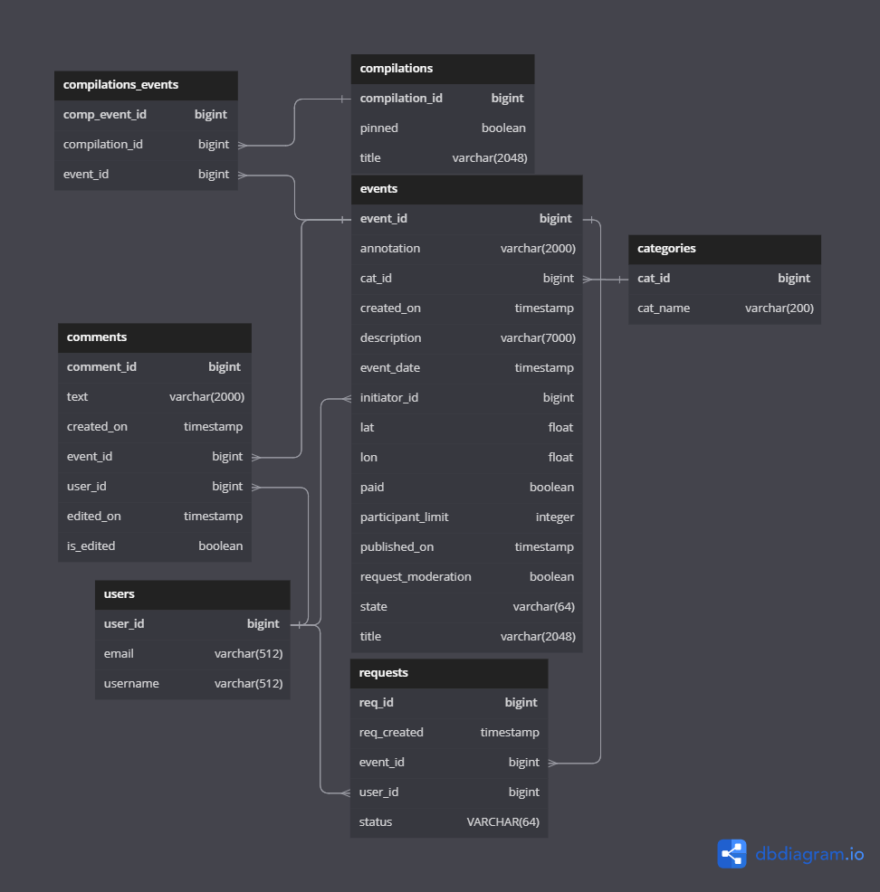
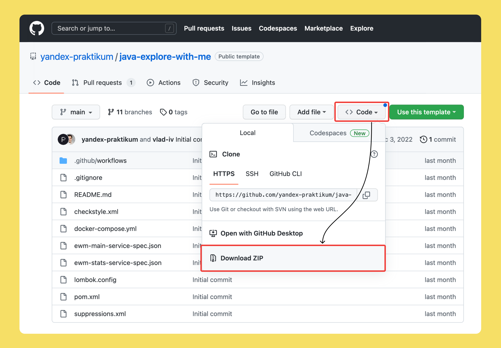
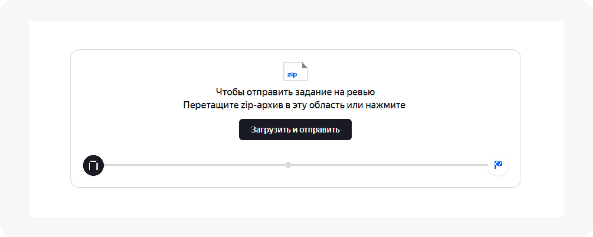
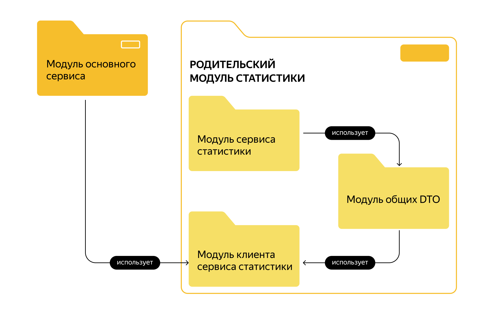

# java-explore-with-me
**Template repository for ExploreWithMe project.**  
### Описание:
Двухмодульное приложение, представляющее собой афишу, где можно:
* публиковать события;
* находить события;
* подавать заявки на участие в событиях;
* комментировать события;
* собирать статистику самых популярных событий;
* создавать и публиковать подборки событий.
* в папке 
### Стек:
* Java 11 (Collections, Optional, Stream);
* Spring Boot;
* Hibernate;
* PostgreSQL;
* Maven;
* Lombok, MapStruct;
* Junit, Mockito;
* Postman;
* Docker;
### Диаграмма базы данных:

#### [Ссылка на финальный Pull Request](https://github.com/laserdi/java-explore-with-me/pull/5)

### Планы по доработке проекта без сроков в свободное время:
* В планах реализовать дополнительный функционал в виде:
  * `subscriptions` — подписки на других пользователей;
  * `rating_events` — лайки/дизлайки, рейтинг мероприятий;
  * `location_processing` — администрирование локаций;
  * `moderation_enhancement` — модерация событий администратором.


******************************************************************************************
******************************************************************************************
******************************************************************************************
******************************************************************************************
******************************************************************************************
# Внизу технические задания для проекта.


#### Пользовательский API работы с комментариями:

```java
Создание комментария пользователем с ID = {} к событию.
        Post        /comments/user/{userId}

Получение комментария с ID  = {} пользователем с ID = {}.
        Get         /comments/{comId}/user/{userId}

Обновление комментария с ID  = {} пользователем с ID = {}.
        Patch       /comments/{comId}/user/{userId}/

Удаление комментария с ID = {} пользователем с ID = {}.
        Delete      /comments/{comId}/user/{userId}

Удаление комментария с ID = {} администратором.
        Delete      /admin/comments/{comId}

Получение списка комментариев к событию с ID = {}
        GET         /comments/event/{eventId}from={from}size={size}
```

# Этап 3. Дополнительная функциональность
Вы уже спроектировали полноценное приложение — и бóльшая часть
дипломной работы позади.
Поздравляем!

Осталось последнее задание — реализация выбранной вами дополнительной
функциональности.
На этом этапе вам предстоит, во-первых, реализовать саму функциональность,
а также написать базовые Postman-тесты, которые будут проверять её 
работоспособность.

### Базовые требования
Реализация должна вестись в отдельной ветке с именем `feature_NAME`,
где `NAME` — краткое название дополнительной функциональности:
* `comments` — комментарии к событиям;
* `subscriptions` — подписки на других пользователей;
* `rating_events` — лайки/дизлайки, рейтинг мероприятий;
* `location_processing` — администрирование локаций;
* `moderation_enhancement` — модерация событий администратором;

> 🔧 Ветка `feature_NAME` должна основываться на ветке `main`, в которую
слиты изменения предыдущего этапа.

### Что будет проверяться
* Работоспособность сервисов, реализованных на предыдущих этапах.
* Наличие базовых Postman-тестов. Они должны проверять коды ответов
спроектированных вами эндпоинтов в рамках реализации выбранной функциональности.
* Полнота и корректность реализации выбранной функциональности.

### Путь к Postman-коллекции
Вам нужно экспортировать Postman-коллекцию и сохранить её в папке Postman.
Сам файл должен называться `feature.json`. Путь к файлу в репозитории
должен быть `postman/feature.json`.

> 💡 На этом этапе у вас три итерации проверки работы.
Последнее усилие — и вы у цели.

### Когда все готово
После того как диплом будет готов, его нужно сдать архивом.
Это необходимо, чтобы сформировать цифровой след — он будет
олицетворять факт успешно завершенного обучения.
Для этого сделайте следующее.

1. В `Readme.md` добавьте ссылку на пул-реквест, открытый из ветки
`feature_NAME` в main. Прикладывайте ссылку именно на пул-реквест,
а не на репозиторий, чтобы ревьюер мог оставить комментарии.
2. В аккаунте GitHub выберите ветку — `feature_NAME`.
3. Нажмите на кнопку “Code” и выберите “Download ZIP”.


> 💡 ВАЖНО! Если размер архива больше 10 МБ, сообщите об этом куратору.
Отправьте загруженный архив с кодом через форму, которую вы видите
на скриншоте ниже.


Не забудьте обновлять архив перед каждой проверкой. Если код в архиве и
репозитории будет отличаться, работа будет отклонена от проверки.
Как только работа будет зачтена, нажмите кнопку `“Merge”`, чтобы применить
изменения из ветки с фичей в `main`.

Поздравляем! Вы проделали огромную работу! Вас ждёт ваше последнее
ревью в Практикуме. После него начнётся ваш самостоятельный путь
в профессии Java-разработчика!

Приступайте к финальному этапу! (╯✧▽✧)╯


******************************************************************************************
******************************************************************************************
******************************************************************************************
******************************************************************************************
******************************************************************************************


# Этап 2. Основной сервис
На прошлом этапе вы подготовили Maven-проект и модуль статистики, который состоит из HTTP-сервиса и HTTP-клиента.
Теперь пришло время реализации основного сервиса! Для начала просмотрите ещё раз техническое задание и изучите
[спецификацию API основного сервиса](https://raw.githubusercontent.com/yandex-praktikum/java-explore-with-me/main/ewm-main-service-spec.json).
[Также можно посмотреть здесь.](ewm-main-service-spec.json).

### Базовые требования
Реализация должна вестись в отдельной ветке с именем `main_svc`. Эта ветка должна основываться на ветке `main`,
в которую слиты изменения предыдущего этапа.

### Что будет проверяться
1. Работающая сборка проекта:
    * проект компилируется без ошибок;
    * основной сервис и сервис статистики успешно запускаются в Docker-контейнерах;
    * для каждого сервиса запускается свой экземпляр PostgreSQL в Docker-контейнере.
2. Корректная работа основного сервиса:
    * все эндпоинты отрабатывают в соответствии со спецификацией;
    * данные успешно сохраняются и выгружаются из базы данных;
    * основной сервис и сервис статистики корректно взаимодействуют;
    * реализация работы с данными не производит лишней нагрузки на базу данных.

##### 💡 На этом этапе у вас три итерации проверки работы.

### После завершения ревью
Также же как и на первом этапе, после того, как все замечания ревьюера будут устранены и ваш Pull Request будет
утверждён — сделайте слияние изменений из ветки `main-svc` в ветку `main`. Для этого вам нужно перейти в ваш
Pull Request на платформе GitHub и нажать кнопку `Merge pull request`.

Не останавливайтесь — всё получится.

Приступайте ко второму этапу! ヽ(・∀・)ﾉ


******************************************************************************************
******************************************************************************************
******************************************************************************************
******************************************************************************************
******************************************************************************************


# Этап 1. Сервис статистики
Первый этап — реализация сервиса статистики. Его функционал достаточно прост и ограничен,
поэтому начать с него будет лучше всего. Реализация сервиса статистики позволит вам 
разобраться со спецификацией API и основными требованиями ТЗ, а также  подготовить сборку
проекта.

На первом этапе необходимо:  
1. Реализовать сервис статистики в соответствии со спецификацией:
[ewm-stats-service.json](ewm-stats-service-spec.json).
2. Реализовать HTTP-клиент для работы с сервисом статистики.
3. Подготовить сборку проекта.
4. Определиться с тематикой дополнительной функциональности, которую вы будете реализовывать.

### Базовые требования
Разработка должна вестись в публичном репозитории, созданном на основе
[шаблона](https://github.com/yandex-praktikum/java-explore-with-me).

Весь код первого этапа разместите в отдельной ветке с именем `stat_svc`.

### Что будет проверяться

* Работающая сборка проекта:
  * проект компилируется без ошибок;
  * сервис статистики успешно запускается в докер-контейнере;
  * экземпляр PostgreSQL для сервиса статистики успешно запускается в докер-контейнере.  
* Корректная работа сервиса статистики:
  * все эндпоинты отрабатывают в соответствии со спецификацией;
  * данные успешно сохраняются и выгружаются из базы данных;
  * реализован HTTP-клиент сервиса статистики.

##### 💡 На этом этапе у вас две итерации проверки работы.

### Как подготовить сборку проекта

1. Учитывайте многомодульность.

Приложение дипломного проекта должно состоять из двух отдельно запускаемых сервисов — в
контексте сборки проекта при помощи Maven это означает, что проект будет многомодульным.
Но это ещё не всё. Сами сервисы можно также разбить на подмодули.
 
Сервис статистики должен состоять из HTTP-сервиса и HTTP-клиента. Это значит, что модуль
статистики можно разделить на два подмодуля.

Механизм взаимодействия сервиса и клиента предполагает, что они будут использовать одни и
те же объекты для запросов и ответов. Исходя из этого, можно выделить еще один подмодуль,
в котором будут размещены общие классы DTO.

Структуру модулей и зависимостей можно представить в виде такой схемы.


2. Поработайте с файлами.
   * модули основного сервиса и сервиса статистики должны содержать `dockerfile`;
   * в корне проекта должен быть создан файл `docker-compose.yml`, описывающий запуск
   контейнеров с сервисами проекта и базами данных для них.
   * файл `pom.xml`, описывающий сборку основного сервиса, на данном этапе должен содержать
   только указание на родительский модуль и идентификатор артефакта.

3. Проверьте обязательные зависимости.

Одной из обязательных зависимостей в каждом из сервисов должен быть `Spring BootActuator`.
Вот идентификаторы для её добавления.
```java
<dependency>
    <groupId>org.springframework.boot</groupId>
    <artifactId>spring-boot-starter-actuator</artifactId>
</dependency>
```

### После завершения ревью
Когда все замечания ревьюера будут устранены и ваш Pull Request будет утверждён,
не забудьте сделать слияние изменений из ветки `stat-svc` в ветку `main`. Для этого
перейдите в ваш Pull Request на платформе GitHub и нажмите кнопку `Merge pull request`.

Начинать большой проект всегда сложно, но важно сделать первый шаг.

Приступайте к первому этапу! (^_-)≡☆
